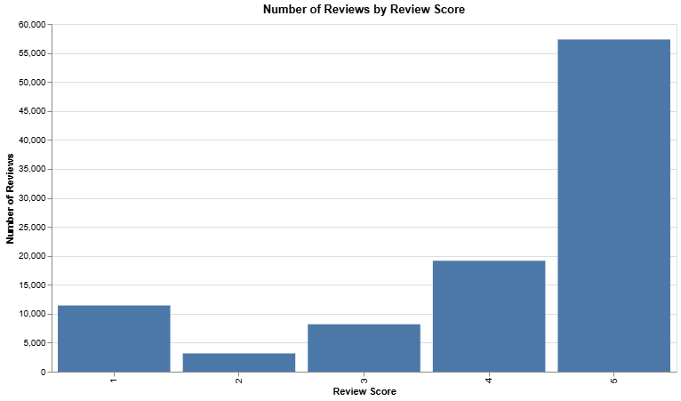
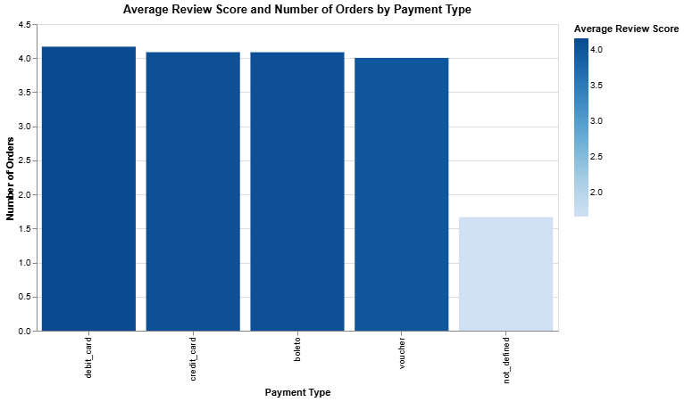
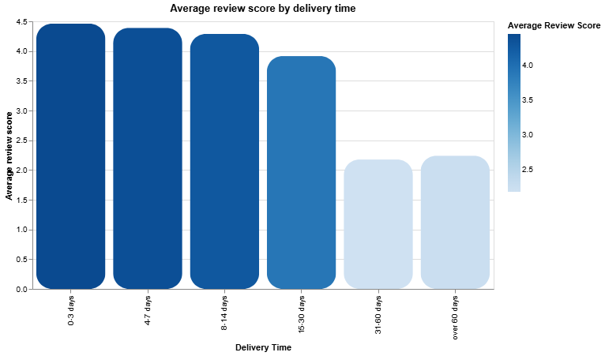
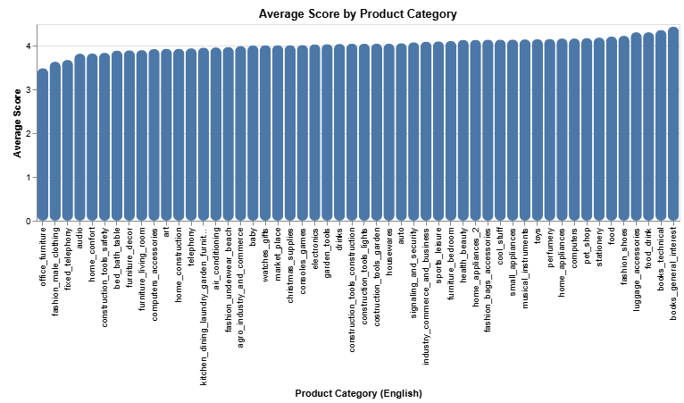

# Are delivery delays associated with low customer ratings? A SQL analysis of Olist orders

## Business Question
What is behind negative customer reviews on Olist — delivery time, product category, or both?

## Data
- **Source**: [Brazilian E-Commerce Public Dataset by Olist](https://www.kaggle.com/datasets/olistbr/brazilian-ecommerce) (Kaggle)

- **Scope**: 9 relational tables — orders, order items, products, customers, sellers, payments, reviews, geolocation, category translations — ~100,000 real orders from a Brazilian e-commerce marketplace, 2016–2018

- **Tools**: Google BigQuery Sandbox (SQL), Google Sheets (light charting)

## Process
- Analysis of the E-Commerce Public Dataset by Olist from Kaggle and download of 9 datasets
- Analyze the relationship between the tables with the help of schema on Kaggle
- Upload the 9 tables to BigQuery Sandbox
- Import error fix on 'order_reviews' by enabling "Quoted newlines"
- Data integrity check across all the tables with 'UNION ALL' to confirm the matching expected numbers

## Quick Number Log
| # | Query | Key metric | Result |
|---|-------|-----------|--------|
| 1 | Review Score Scale | count per score (1–5) | **5 Stars** : *57,328* ,  **4 Stars** :*19,142*, **3 Stars**: *8,179*, **2 Stars** : *3,151*, **1 Star**: *11,424* |
| 2 | Payment method – review score analysis| Score by payment type| debit card **4.17 Stars** vs. voucher **4.00 Stars** — no real gap  |
| 3 | Delivery completion rate | Completion status | delivered **96,478** **(97.0%)** · shipped **1,107** · canceled **625** · unavailable **609** · other **622** |
| 4 | How long does delivery typically take? | min / max  avg days | Average : **12 days**; one case : **7 months**, 288 orders (0.3%): **exceeds 60 days**|
| 5 | Average review score by delivery time | Fast delivery vs. slowest delivery |0-3 days → **4.46** (n=8,596) · 31-60 days → **2.18** (n=3,757)|
| 6 | Which product category has the worst reviews?| Worst-performing category at two different sample-size cutoffs | diapers_and_hygiene **3.26** (n=39) → office_furniture **3.49** (n=1,687) |

## Exploratory Walkthrough
**1. Review score distribution**

Most of the reviews are 5-star and 4 star, but there is a second spike at 1-star, which brings the question : What makes the customer very unhappy about the platform?

[`sql queries/01_review_score_distribution.sql`](sql%20queries/01_review_score_distribution.sql)

**2. Payment method vs. review score - no link**

Checked whether the payment method used (credit card, debit card, boleto, or voucher) affects how satisfied customers are. It doesn't — all four methods average between 4.0 and 4.17, essentially the same.

Also, the fifth category (not_defined) shows a lower score, but it is based only on 3 records, which is a too small group to take in count.

[`sql/02_payment_method_vs_review.sql`](sql/02_payment_method_vs_review.sql)

**3. Delivery time vs. review score (main finding)**

Checked if the delivery time can affect the review score.

***3.1***
First, excluded orders that were never delivered (about 3% of the total), since delivery time can't be measured for those

[`sql/03_order_status_breakdown.sql`](sql/03_order_status_breakdown.sql)

***3.2*** Compared the delivery time vs the review score.

[`sql/04_avg_review_score_by_delivery_time.sql`](sql/04_avg_review_score_by_delivery_time.sql)

***Main finding*** : The longer the delivery time, the lower the score.
At first, the drop is mild, then it falls sharply somewhere between two weeks and a month. After this period, extra delay doesn't really change the situation, because the damage is already done by then.

Fast delivery (0-3 days) = **4.46**

Slow delivery (30+ days) = **2.2**
This pattern shows up multiple times and is confirmed by the graph.

**4. Product category vs. review score (secondary finding)**

A few categories have lower scores, but the gap is too small ( 3.3-4.7), compared to the delivery-time finding.

[`sql/05_category_ranking_filtered.sql`](sql/05_category_ranking_filtered.sql)

## Key Findings

1. **Delivery time directly influences customer dissatisfaction.**

Specifically, delivery delays have a big impact on the review scores from 4.46(0-3 day delivery) to 3.91 (15-30 days) and then to 2.2 for all the deliveries that take more than 30 days.

2. **The worst review scores occur in the window of 15 to 60 days delivery.**

The sharpest drop in satisfaction happens within the 15 to 60 days window. This is the critical time when the customers lose their patience.

3. **Beyond 30 days the review score doesn't really change, because it is already bad.**
There is a similar score between "31-60 days" and "over 60 days", which are already bad : 2.18 and 2.24.

4. **Product category has a small effect on the review score, but not as important as the delivery time.**

Most categories present the same review score. A few of them, with very few reviews are not reliable, because the sample is too small to trust.
Outlier, 'office_furniture' has a trustworthy sample size and the lowest review score, but it is still much closer to the average product categories when compared to the delivery-time effect.

5. **Payment methods have no impact on the review scores**.

## Recommendation

Knowing that satisfaction drops sharply after delivery time exceeds 2 to 4 weeks, Olist should build an alert and tracking system that flags orders approaching that threshold, so the operations team can start early interventions (customer communication, carrier escalation) before the customer's experience is damaged — a notification is only useful if it reaches whoever can actually act on it.

Moreover, since many customers likely value fast delivery, Olist could introduce a paid option for faster delivery, or a guarantee that promises delivery within a set window, with compensation (partial refund or credit) if that window is missed. This turns a known pain point into a product opportunity rather than just a problem to minimize.

The investigation could go further by analyzing region, carrier, or seller to determine which distributors are performing better on shipping times, to address the delay problem at its source rather than only reacting to it after the fact.

The scale here matters: over 4,000 orders in this dataset fall into the 31+ day delay range, each associated with review scores roughly two points lower than a fast delivery. At Olist's volume, that represents a meaningful, recurring hit to reputation and repeat-purchase likelihood — not just a handful of unhappy one-off customers.

Product category, by comparison, is a secondary factor and shouldn't be a primary focus for improving satisfaction scores.

## Limitations

- This shows correlation, not proven causation. The data only captures review score and delivery time — some items may simply have been damaged or of poor quality, which could explain a bad review independent of how late it arrived.
- The analysis doesn't account for which carrier or logistics provider handled each delivery — different carriers may perform very differently, and this dataset doesn't let us separate that out.
- The data is from 2016-2018, and Brazil is a large country where logistics vary a lot by region — there's no information on how the situation has evolved since then.
- The study excludes almost 3% of orders that were not marked as delivered (canceled, shipped, unavailable, etc.) — there's no data on why these deliveries failed, and they may represent an even worse experience than anything captured here.
- The "over 60 days" group rests on a smaller sample (282 orders) than the others — directionally solid, but treat with slightly less precision.
- Some product categories have too few reviews to be trusted, which limits confidence in their ranking compared to categories with much larger sample sizes.

## Files

- `sql/01_review_score_distribution.sql`
- `sql/02_payment_method_vs_review.sql`
- `sql/03_order_status_breakdown.sql`
- `sql/04_avg_review_score_by_delivery_time.sql`
- `sql/05_category_ranking_filtered.sql`
- `images/` — chart exports referenced above
- **Raw data:** not included in this repo due to file size — download directly from [Kaggle](https://www.kaggle.com/datasets/olistbr/brazilian-ecommerce)
