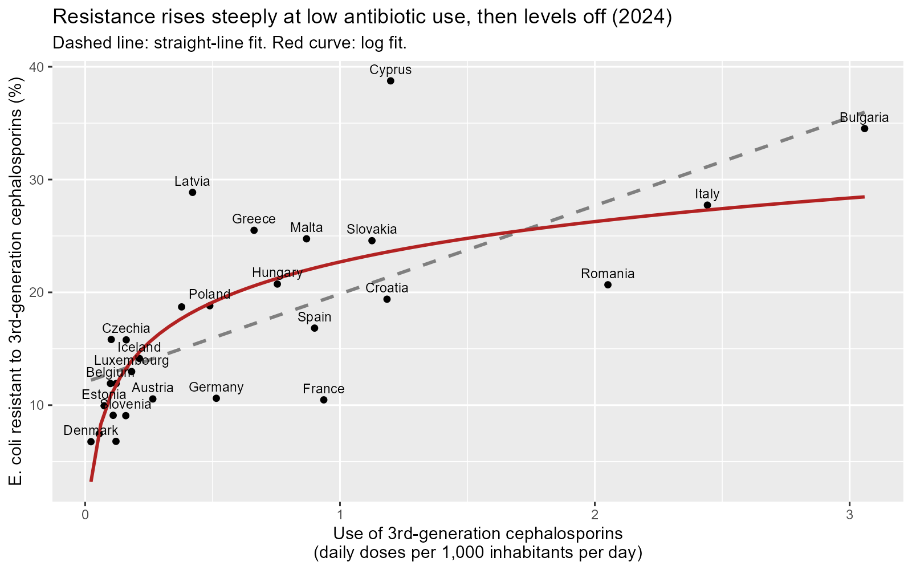
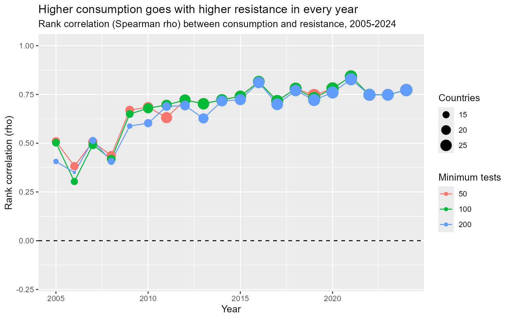

# The use and bacterial resistance of antibiotics in the European Union

## Do EU nations that use higher levels of third-generation cephalosporins also have more *E. coli* resistant to these antibiotics?

I was interested to see whether countries that use more of these antibiotics also have higher resistance. It seems reasonable to expect a connection, since antibiotics can remove bacteria that are sensitive to them, while resistant bacteria survive. The survivors can then reproduce and spread.

To analyze this, I used data on antibiotic use and bacterial resistance from the European Centre for Disease Prevention and Control (ECDC). I cleaned and merged the files in R. Then I compared countries in 2024. Next, I tested whether a curved relationship fitted better than a straight line. I ran the same analysis over 2005–2024. I also examined more closely the countries that did not follow the overall pattern.

## What I found

In 2024, countries with higher consumption tended to have higher resistance across the 28 European countries studied (Spearman's rho = 0.77, p < 0.001).

- In the linear model, each additional defined daily dose per 1,000 inhabitants per day was associated with 7.8 percentage points higher resistance. The model accounted for about 50% of the differences in resistance between countries (R² = 0.50).
- A log curve fits the data slightly better (R² = 0.57). The link between the two variables was steep at low levels of consumption but leveled off at higher levels.
- The association remained positive in every year from 2005 to 2024. Checks using different sample-size cutoffs and removing selected countries supported the main result.
- Cyprus and Latvia had more resistance than predicted by their consumption; France and Romania had less. This investigation can’t explain those differences.

## A closer look at the results

The fitted log curve rises from about 7% resistance at 0.05 daily doses per 1,000 inhabitants per day to about 28% at 3 doses. It fits better than the straight line, although the improvement is modest: R² = 0.57 versus 0.50.

Only Bulgaria, Italy, and Romania sit at the flatter end of the curve. With just three countries there, that part of the fit is less certain than the steep part.



The next question was whether the 2024 result held in other years. The association was positive in every year from 2005 to 2024, though it was weaker early on. In 2005–2008, rho ranged from 0.30 to 0.50, with only 15–18 countries in the comparison. It was not statistically significant in 2006 or 2008.

From 2010, the association was significant every year (p < 0.001). Since 2016, rho has stayed between 0.72 and 0.84.

Removing Cyprus, Bulgaria, or Cyprus, Latvia, and France together left rho between 0.75 and 0.85. Changing the minimum number of tested isolates per country-year to 50, 100, or 200 changed the yearly correlations by at most 0.10, and by less than 0.03 since 2014.



Cyprus and Latvia had higher resistance than predicted by the straight line, while France and Romania had lower resistance. These countries also stood out from the log fit.

| Country | Difference from the linear model’s prediction |
|---|---:|
| Cyprus | +17 percentage points |
| Latvia | +13.5 percentage points |
| France | −9 percentage points |
| Romania | −7 percentage points |

These gaps are larger than the sampling margin of error. For example, Cyprus’s margin was about ±4.8 percentage points, based on 400 tests in 2024, suggesting that sampling chance alone is unlikely to explain the gap. There could be biological reasons or differences in health systems behind them. Differences in how the data are collected could also matter; this analysis cannot separate those explanations.

## Data sources

All three source files come from ECDC and were downloaded on 28 September 2026. Countries can revise past submissions, so later downloads may differ slightly.

| File in `sources data/` | Source | What it contains |
|---|---|---|
| `ECDC_surveillance_data_Antimicrobial_resistance_R.csv` | [ECDC Surveillance Atlas, EARS-Net](https://www.ecdc.europa.eu/en/about-us/networks/disease-networks-and-laboratory-networks/ears-net-data) | Percentage of *E. coli* isolates resistant to third-generation cephalosporins, by country and year |
| `ECDC_surveillance_data_Antimicrobial_resistance_total.csv` | [ECDC Surveillance Atlas, EARS-Net](https://www.ecdc.europa.eu/en/about-us/networks/disease-networks-and-laboratory-networks/ears-net-data) | Number of isolates tested behind each resistance percentage, used to assess sample size |
| `esac_net_J01DD_total_care_DDD_2005-2024.xlsx` | [ECDC antimicrobial consumption dashboard, ESAC-Net](https://www.ecdc.europa.eu/en/antimicrobial-consumption/surveillance-and-disease-data/database) | Consumption of third-generation cephalosporins (ATC group J01DD), community and hospital combined, in defined daily doses per 1,000 inhabitants per day |

### Export settings

To download the same data:

- Resistance: select the topic “Antimicrobial resistance”, *E. coli*, third-generation cephalosporins, and the indicators “R - resistant isolates, percentage” and “Total tested isolates”. Use all regions and all time periods, with a non-pivoted CSV export.
- Consumption: select “Country comparison (trend of consumption)”, ATC group level 4 = J01DD, total care sector, and DDD per 1,000 inhabitants per day. Use the 20-year range up to 2024 and export to Excel.

## How the analysis works

The three tables are joined by country and year. Each row represents one country in one year, with its resistance percentage, number of tested isolates, and antibiotic consumption. An isolate is a bacterial sample from one patient’s infection, grown and tested in a lab. Here, the samples come from blood or spinal fluid.

Consumption is measured in defined daily doses (DDD), a standard adult daily dose used to compare different drugs. DDD per 1,000 inhabitants per day expresses how many of these doses are taken daily per 1,000 people.

### Cleaning decisions

`01_import_and_clean.R` applies these rules:

- Read missing values (`"-"`) as missing and convert years stored as text in the Excel file to numbers.
- Exclude Liechtenstein because it has only 8–13 tests per year.
- Use data from 2005 onwards, when 28–30 countries report each year. The number with both consumption and resistance data is smaller in the early years.
- Treat Cyprus’s 2023 consumption as missing: it is recorded as 0.00, while neighbouring years are about 1.1–1.3.
- Exclude country-years with fewer than 100 tested isolates. Repeat the analysis with cutoffs of 50 and 200 as sensitivity checks.

The resulting counts are 586 joined country-years, 481 with both values, and 470 after the 100-test cutoff, covering 30 countries.

### Statistical approach

The main test uses Spearman’s rank correlation. It asks whether countries that rank higher on consumption also rank higher on resistance, on a scale from −1 to +1. Comparing rankings limits the influence of an extreme consumption value, such as Bulgaria’s. The p-value indicates how surprising a result this strong would be if there were no association.

- Null hypothesis (H0): across countries, consumption and resistance are not associated.
- Alternative hypothesis (H1): countries with higher consumption tend to have higher resistance.

A linear regression estimates the size of the association, and its residuals identify countries above or below the fitted trend. R² measures the share of the differences between countries explained by the model, from 0 (none) to 1 (all). A log curve checks the shape of the relationship. The robustness checks remove selected countries and repeat the correlation for each year at three sample-size cutoffs.

| Script | What it does |
|---|---|
| `01_import_and_clean.R` | Reads, cleans, and joins the three source files; checks row counts; saves `data_clean/amr_clean.csv`; and draws a first scatter plot |
| `02_first_test.R` | Runs the 2024 Spearman correlation and linear regression, then examines residuals to identify countries that do not follow the trend |
| `03_robustness.R` | Compares the straight line with a log curve, removes influential countries, and repeats the yearly test at three sample-size cutoffs |

## Limitations

- Country comparisons cannot establish causation. Although antibiotic use can favour resistant bacteria, this comparison cannot show that consumption caused the observed differences in resistance. Prescribing habits and hospital hygiene also vary between countries, as does the way resistant bacteria spread.
- The size and shape estimates rely on 2024 and 28 countries. The yearly checks add context, but they are not 20 independent tests because the same countries appear repeatedly.
- Surveillance data are not fully comparable. Resistance is measured only in infections found in blood or spinal fluid. Countries differ in how often they take blood cultures and how many hospitals report. France changed its reporting network in 2020. Some countries report only combined or partial consumption totals.
- Missing data and exclusions affect coverage. Liechtenstein was excluded, the main analysis requires at least 100 tests per country-year, and Cyprus’s 2023 consumption was treated as missing. Some countries have consumption data only from later years—for example, Germany from 2023, and Austria and Czechia from 2019. The 2005–2009 comparisons therefore cover only 15–18 countries, which may partly explain the weaker early results.
- Timing and outliers remain unresolved. Resistance may respond to earlier consumption, but this analysis compares resistance and consumption in the same year. It also cannot explain why some countries sit far from the fitted trend.

## What I would explore next

One next step would be to compare resistance with consumption in earlier years, since the response may take time. I would also like to look at total antibiotic use across all classes.

To investigate the outliers, I could add a country-level variable such as average annual temperature. A further extension would be to model changes within countries over time, rather than relying on comparisons between countries.

## How to reproduce the analysis

1. Use R 4.1 or later. Install the required packages once:

   ```r
   install.packages(c("tidyverse", "readxl"))
   ```

2. Open `03_R_Antibiotic_Resistance.Rproj` in RStudio. The scripts use relative paths, so run them from the project folder.
3. Run the scripts in this order:

   ```r
   source("01_import_and_clean.R")
   source("02_first_test.R")
   source("03_robustness.R")
   ```

4. After the first script, check that the console prints 586, 481, 470, and 30 for the row and country counts.

### Repository structure

```text
.
├── data_clean/                       Cleaned table created by script 01
├── figures/                          Charts, including those created by script 03
├── sources data/                     Raw ECDC files, as downloaded
├── 01_import_and_clean.R
├── 02_first_test.R
├── 03_robustness.R
├── 03_R_Antibiotic_Resistance.Rproj   RStudio project file
└── README.md
```


